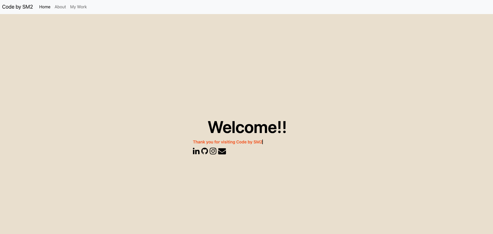
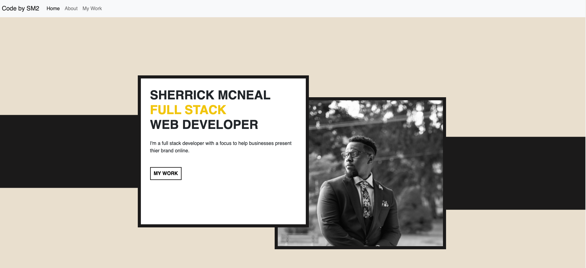
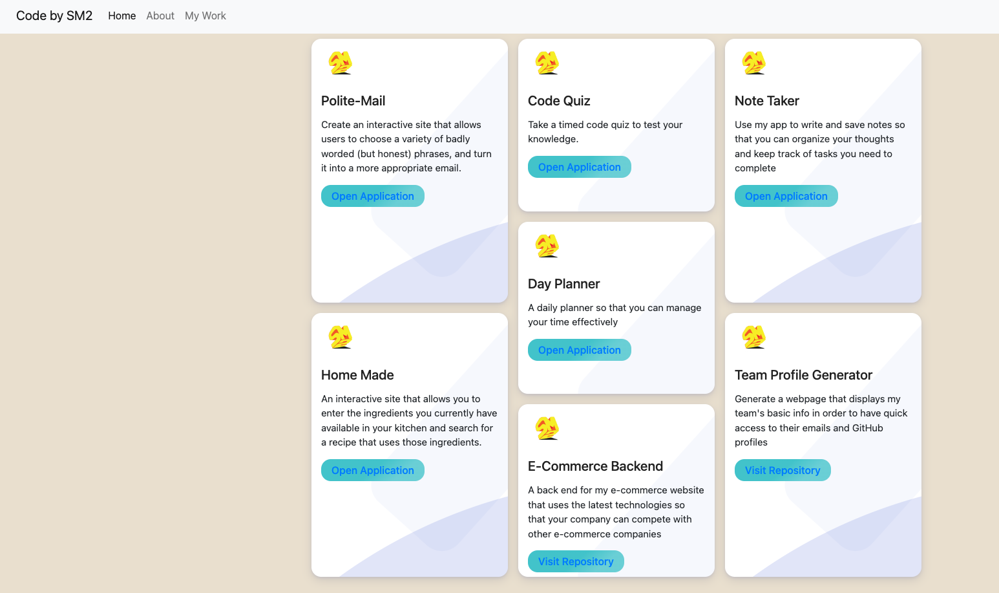
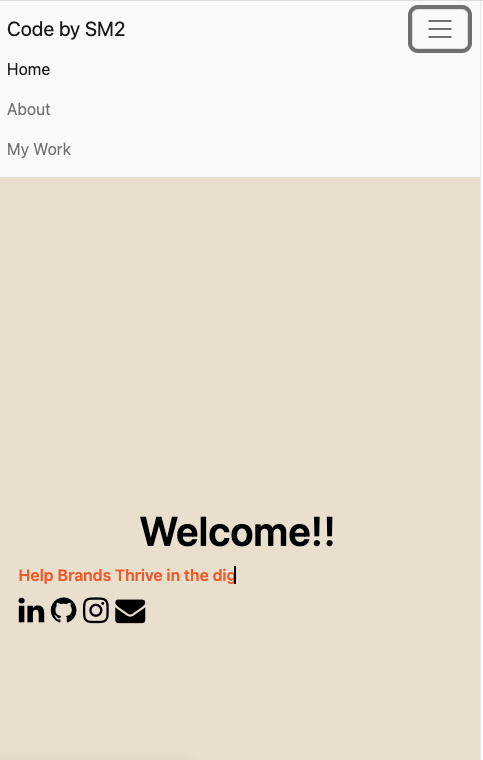

# portfolio-2

# Description 

This portfolio showcases all of the applications that I has created through the LPS Penn web-developing program. As my knowledge expands the website application will be more interactive and expressive of who I am as a developer. Thank you for taking the time to review my code.

# Mock-up

	

# Deployed Site

> https://sherrickm.github.io/portfolio-2/

# GitHub Repo

> https://github.com/SherrickM/portfolio-2 

